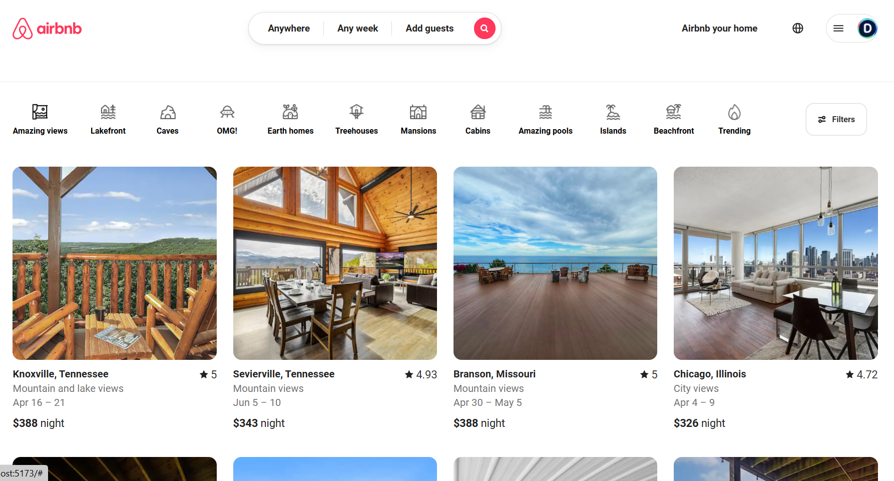
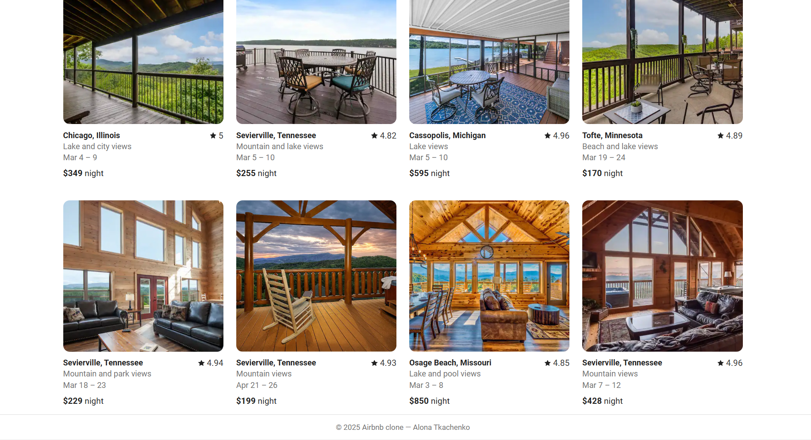

# 🏠 Airbnb Startseite – Nachbau

Dies ist ein Nachbau der **Airbnb-Startseite** mit **React.js** und **Vite** basierend auf einem Figma-Design.  
Es wird modernes HTML, SCSS, komponentenbasierte Architektur und Responsive Design verwendet.

## 📐 Figma-Design

🔗 [Zum Figma-Design](https://www.figma.com/design/9ztmYJPvOWYacD6CbwmyQN/AirBnB-Homepage?node-id=1-4536&t=RYcHy5OCRrBFG0md-0)

## 🚀 Technologien

- ⚛️ React + Vite
- 🎨 SCSS (Sass)
- 📦 CSS-Module (`.module.scss`)
- 📁 Komponentenbasierte Struktur
- 💎 Verwendung von SVGs und lokalen Bildern
- 🧩 Optional: React Router
- 📱 Responsive Webdesign

📂 Projektstruktur
src/
├── assets/              # Bilder, Icons, SVG-Dateien
├── components/          # Wiederverwendbare Komponenten (Header, Footer, Card, etc.)
├── data/                # JSON-Daten (Kategorien, Karteninhalte)
├── styles/              # Globale Styles: reset.scss, vars.scss, index.scss
├── App.jsx              # Hauptkomponente
└── main.jsx             # Einstiegspunkt

📸

ℹ️ Hinweise
Icons sind im SVG-Format eingebunden

Variablen und Schriftarten sind global über :root in vars.scss definiert

Jeder Komponente ist eine eigene Style-Datei (style.module.scss) zugeordnet

👩‍💻 Autorin
Alona Tkatschenko

